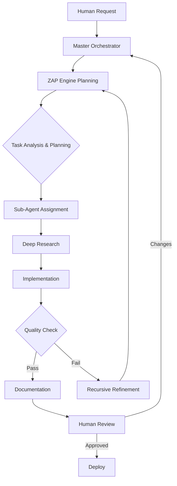

# AIGO-Syndicate Construction Intelligence - Master Orchestration Guide

## 🏗️ System Overview

Welcome to the AIGO-Syndicate Construction Intelligence system. This is a quantum-inspired, production-grade superintelligence specifically designed for German construction projects with HOAI compliance.

### Core Principles

1. **Production-Only Code**: NO mocks, simulations, or stubs - ever
2. **Deep Connections**: Every implementation connects 5-7 existing systems
3. **Error Enhancement**: Bugs become features through sophisticated fixes
4. **Quantum-Inspired**: Advanced algorithms on classical hardware (NOT quantum hardware)
5. **24/7 Autonomous**: Continuous operation with self-healing capabilities

## 🎯 Development Workflow

### 1. Recursive Development Cycle



**CRITICAL**: The ZAP Engine (Zero-shot Augmented Planning) is inserted early in the workflow to create comprehensive plans BEFORE implementation begins!

### 2. Agent Collaboration Pattern

When implementing any feature:

1. **Explorer Agent** finds existing relevant code
2. **Research Documenter** gathers external resources
3. **Specialist Agents** implement with deep expertise
4. **Security Officer** verifies safety and compliance
5. **Documentation Specialist** creates comprehensive docs
6. **Master Orchestrator** ensures integration

### 3. Human-in-the-Loop Triggers

Always consult human for:
- Architecture decisions affecting >3 systems
- New external dependencies
- Database schema changes
- API contract modifications
- Production deployment approval
- Error patterns requiring new prevention systems

## 🔧 Technical Architecture

### ZAP Engine - Strategic Planning Core

**ESSENTIAL COMPONENT**: The Zero-shot Augmented Planning (ZAP) Engine is the strategic planning brain:

```javascript
// ZAP is CRITICAL for solving complex tasks
const zapEngine = ServiceRegistry.get('zapEngine');

// Every complex task MUST go through ZAP planning
const plan = await zapEngine.generatePlan(complexTask, context);

// ZAP integrates 20+ systems for comprehensive planning
const executionSteps = plan.steps; // Causally ordered, verified steps
```

**Integration**: ZAP connects to ALL major systems:
- Three Pillars Prevention (validation)
- Reasoning Systems (GOT, COT, TOT)
- Quantum Systems (parallel exploration)
- Knowledge Graphs (augmentation)
- Causal Engine (dependency modeling)

### Service Registry Pattern

All services use dependency injection:

```javascript
// NEVER direct imports between services
import { ServiceRegistry } from './core/ServiceRegistry.js';

// ALWAYS use registry
const registry = ServiceRegistry.getInstance();
const quantumEngine = registry.get('quantumEngine');
```

### Lazy Module Loading

Optimize startup with lazy loading:

```javascript
// Use LazyModuleLoader for non-critical modules
const LazyModuleLoader = registry.get('lazyLoader');
const heavyModule = await LazyModuleLoader.loadModule('./heavy-module.js');
```

### State Persistence

Every system MUST implement state persistence:

```javascript
class YourSystem {
    async saveState() {
        await this.persistenceEngine.save(this.stateKey, this.state);
    }
    
    async loadState() {
        this.state = await this.persistenceEngine.load(this.stateKey);
    }
}
```

## 🧠 Quantum-Inspired Concepts

### Implementation on Classical Hardware

All "quantum" features are algorithmic inspirations:

- **Superposition**: Parallel hypothesis exploration
- **Entanglement**: Agent state correlation
- **Coherence**: System synchronization
- **Amplitude**: Decision quality scoring

Example:
```javascript
// Quantum-inspired decision making
const decisions = await this.exploreDecisionSuperposition(options);
const collapsed = this.collapseToOptimal(decisions);
```

## 🏛️ HOAI Compliance

### Construction Phases

System specializes in:
- **LP6**: Vergabevorbereitung (Tender Preparation)
- **LP7**: Mitwirkung bei Vergabe (Assistance with Award)

All construction operations MUST:
1. Verify HOAI phase compliance
2. Generate audit trails
3. Provide mathematical verification
4. Support German language output

## 🤖 Agent Communication

### Message Format

```javascript
{
    from: 'agent-id',
    to: 'agent-id',
    type: 'request|response|broadcast',
    priority: 'low|normal|high|critical',
    payload: {
        task: 'task-description',
        context: {},
        constraints: [],
        deadline: 'ISO-8601'
    },
    metadata: {
        traceId: 'uuid',
        timestamp: 'ISO-8601',
        reasoning: 'COT|TOT|GOT|ZAP'
    }
}
```

### Collaboration Protocols

1. **Sequential**: For dependent tasks
2. **Parallel**: For independent operations
3. **Hierarchical**: For complex orchestrations
4. **Swarm**: For emergent solutions

## 📚 Documentation Standards

### Every System Must Document:

1. **What**: Clear purpose statement
2. **Why**: Problem it solves
3. **How**: Technical implementation
4. **When**: Usage scenarios
5. **Where**: Integration points
6. **Who**: Responsible agents

### Investor-Ready Format

```markdown
## System Name

### Executive Summary
[1-2 sentences for non-technical readers]

### Business Value
- Problem solved
- Cost savings
- Efficiency gains
- Competitive advantages

### Technical Excellence
- Architecture highlights
- Performance metrics
- Security features
- Scalability proof
```

## 🚀 Deployment Process

### Local Development

```bash
# Start in development mode
node start-syndicate.js debug

# Test specific system
node test-[system-name].js

# Run comprehensive tests
npm test
```

### Production Deployment

```bash
# Deploy to 896GB server
./deploy-to-production-server.js

# Or manual deployment
ssh root@162.55.83.33
cd ~/LocalBackup
git pull origin main
pnpm install --production
pm2 restart construction-syndicate
```

## 🛡️ Safety Mechanisms

### Three Pillars Prevention System

1. **Knowledge Pipeline**: Proactive data validation
2. **Inference Engine**: Predictive error detection  
3. **Veracity Judge**: Truth verification

### Overtraining Prevention

- Memory distillation at 80% capacity
- Creativity enhancement through randomness
- Adaptation score monitoring
- U-curve detection

### Formal Verification

All critical operations use mathematical proofs:
```javascript
const proof = await this.formalVerifier.prove(operation);
if (!proof.isValid) {
    throw new VerificationError(proof.counterexample);
}
```

## 🌐 External Integrations

### MCP Servers

Essential servers for development:
- **Filesystem**: Code navigation
- **Postgres**: Database queries
- **GitHub**: Version control
- **Memory**: Context persistence

### Internet of Agents

- SLIM protocol for secure communication
- Agent discovery via registry
- Capability-based matching
- Cross-platform compatibility

## 🔍 Debugging & Monitoring

### System Health Checks

```bash
# Check system status
curl http://localhost:3001/health

# View logs
pm2 logs construction-syndicate

# Monitor performance
pm2 monit
```

### Debug Mode Features

- Verbose logging
- Step-through reasoning
- Memory inspection
- Performance profiling

## 🎯 Best Practices

### DO:
- ✅ Connect to 5-7 existing systems per feature
- ✅ Use ServiceRegistry for all dependencies
- ✅ Implement comprehensive error handling
- ✅ Document every architectural decision
- ✅ Test with real production data
- ✅ Verify HOAI compliance
- ✅ Use quantum-inspired patterns

### DON'T:
- ❌ Use mocks or simulations
- ❌ Create shallow implementations
- ❌ Skip mathematical verification
- ❌ Ignore error enhancement opportunities
- ❌ Deploy without human approval
- ❌ Break existing integrations
- ❌ Assume instead of verifying

## 🚨 Emergency Procedures

### System Failure

```bash
# Emergency shutdown
./emergency-control.js kill

# Switch to observation mode
./emergency-control.js switch observation

# Check status
./emergency-control.js status
```

### Rollback Process

```bash
# Restore previous version
cd ~/LocalBackup
git checkout [last-stable-commit]
pm2 restart construction-syndicate
```

## 📈 Continuous Improvement

### Learning from Production

1. Monitor error patterns
2. Enhance prevention systems
3. Update documentation
4. Refine algorithms
5. Expand capabilities

### Research Integration

- Weekly ArXiv paper reviews
- Industry publication monitoring
- Patent analysis for innovations
- Competitive intelligence gathering

---

Remember: Every line of code contributes to building the world's most sophisticated construction intelligence system. Think quantum, implement classical, deliver excellence! 🚀
