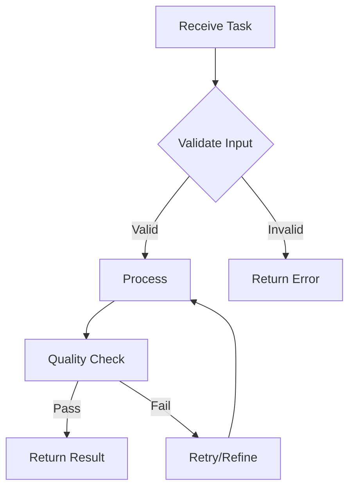

# [Agent Name] Documentation

<!-- Replace [Agent Name] with the actual agent name -->

## Executive Summary [REQUIRED]

### Agent Purpose
<!-- One paragraph explaining what this agent does and why it exists -->

### Unique Value
<!-- What makes this agent special or necessary -->

### Key Responsibilities
<!-- Bullet list of 3-5 main responsibilities -->
- 
- 
- 

---

## Personality & Character [REQUIRED]

### Core Traits
| Trait | Value (0-1) | Description |
|-------|-------------|-------------|
| Assertiveness | 0.X | How forceful in decision-making |
| Creativity | 0.X | Innovation and novel solutions |
| Precision | 0.X | Attention to detail |
| Collaboration | 0.X | Teamwork orientation |
| Risk Tolerance | 0.X | Willingness to try new approaches |

### Communication Style
<!-- Describe how this agent communicates -->
- **Tone**: [Professional/Casual/Technical/etc.]
- **Detail Level**: [High/Medium/Concise]
- **Response Pattern**: [Immediate/Thoughtful/Analytical]

### Decision-Making Approach
<!-- How does this agent make decisions -->
- **Primary Method**: [Data-driven/Intuitive/Consensus-based/etc.]
- **Consideration Factors**: 
- **Speed vs Accuracy Balance**: 

---

## Technical Capabilities [REQUIRED]

### Core Skills
```javascript
// Primary capabilities
const coreSkills = {
    skill1: {
        name: "Skill Name",
        proficiency: 0.95,
        description: "What this enables"
    },
    skill2: {
        name: "Skill Name",
        proficiency: 0.90,
        description: "What this enables"
    }
};
```

### Specialized Knowledge
<!-- Domain-specific expertise -->
- **Domain 1**: [Description and depth]
- **Domain 2**: [Description and depth]
- **Domain 3**: [Description and depth]

### Tool Proficiency
| Tool/System | Proficiency | Use Cases |
|-------------|-------------|-----------|
| [Tool 1] | Expert | [When/how used] |
| [Tool 2] | Advanced | [When/how used] |
| [Tool 3] | Intermediate | [When/how used] |

---

## Integration Points [REQUIRED]

### Agent Dependencies
```javascript
// Agents this agent frequently works with
const collaborators = {
    "agent-id-1": {
        relationship: "peer",
        interaction: "data exchange",
        frequency: "constant"
    },
    "agent-id-2": {
        relationship: "supervisor",
        interaction: "task assignment",
        frequency: "periodic"
    }
};
```

### System Connections
<!-- What systems does this agent connect to -->
- **Database**: [Which tables/collections]
- **APIs**: [Internal/External APIs used]
- **Services**: [Microservices or external services]
- **Knowledge Graphs**: [KG/QKG connections]

### Communication Protocols
```javascript
// Message format for this agent
const messageFormat = {
    request: {
        agentId: "string",
        taskType: "string",
        priority: "low|medium|high|critical",
        payload: {},
        deadline: "ISO-8601"
    },
    response: {
        success: "boolean",
        result: {},
        confidence: "number (0-1)",
        reasoning: "string"
    }
};
```

---

## Usage Examples [REQUIRED]

### Example 1: [Common Use Case]
```javascript
// Initialize agent
const agent = new AgentName({
    config: {
        // configuration
    }
});

// Execute task
const result = await agent.executeTask({
    type: 'analysis',
    data: inputData,
    constraints: {}
});

// Result structure
console.log(result);
// {
//   success: true,
//   analysis: { ... },
//   confidence: 0.92,
//   recommendations: [ ... ]
// }
```

### Example 2: [Advanced Use Case]
```javascript
// Multi-step workflow example
const workflow = await agent.createWorkflow({
    steps: [
        { action: 'analyze', target: data },
        { action: 'optimize', constraints: rules },
        { action: 'validate', threshold: 0.95 }
    ]
});

const results = await workflow.execute();
```

### Example 3: [Integration Example]
```javascript
// Working with other agents
const collaboration = await agent.collaborate({
    withAgent: 'other-agent-id',
    task: 'joint-analysis',
    data: sharedData
});
```

---

## Configuration [REQUIRED]

### Environment Variables
```bash
# Required environment variables
AGENT_NAME_API_KEY=xxx
AGENT_NAME_MODEL=model-version
AGENT_NAME_TIMEOUT=30000
```

### Configuration Options
```javascript
const agentConfig = {
    // Core settings
    core: {
        maxConcurrentTasks: 5,
        timeoutMs: 30000,
        retryAttempts: 3
    },
    
    // Personality settings
    personality: {
        assertiveness: 0.7,
        creativity: 0.8,
        precision: 0.9
    },
    
    // Performance settings
    performance: {
        cacheEnabled: true,
        batchSize: 100,
        parallelism: 4
    },
    
    // Integration settings
    integrations: {
        databasePool: 'main',
        apiEndpoint: 'https://api.example.com',
        messageQueue: 'agent-queue'
    }
};
```

### Tuning Guide
| Parameter | Default | Range | Impact |
|-----------|---------|--------|---------|
| `assertiveness` | 0.7 | 0.0-1.0 | Higher = more decisive |
| `batchSize` | 100 | 10-1000 | Higher = better throughput |
| `timeoutMs` | 30000 | 1000-300000 | Higher = allows complex tasks |

---

## Workflows [REQUIRED]

### Primary Workflow


### Collaboration Workflow
<!-- How this agent works with others -->
1. **Task Receipt**: How tasks are received
2. **Decomposition**: How complex tasks are broken down
3. **Delegation**: When/how to involve other agents
4. **Integration**: How to combine results
5. **Validation**: Quality assurance steps

---

## Performance Metrics [REQUIRED]

### Key Performance Indicators
| Metric | Target | Current | Notes |
|--------|--------|----------|-------|
| Response Time | <2s | 1.5s | 95th percentile |
| Accuracy | >95% | 97% | Based on validation |
| Throughput | 100/min | 120/min | Peak capacity |
| Error Rate | <1% | 0.5% | Excluding input errors |

### Resource Usage
- **CPU**: Average 15%, Peak 40%
- **Memory**: Average 512MB, Peak 2GB
- **Network**: ~10 requests/second
- **Storage**: 100MB cache, 1GB logs

### Optimization Opportunities
<!-- Areas for improvement -->
1. **Caching**: [What could be cached]
2. **Parallelization**: [What could run in parallel]
3. **Algorithm**: [Better algorithms to consider]

---

## Troubleshooting [REQUIRED]

### Common Issues

#### Issue: Agent Timeout
**Symptoms**: Tasks fail after 30 seconds
**Cause**: Complex analysis exceeding time limit
**Solution**: 
```javascript
// Increase timeout for complex tasks
agent.config.timeoutMs = 60000;
```

#### Issue: Memory Overflow
**Symptoms**: Agent crashes with OOM error
**Cause**: Large dataset processing
**Solution**: 
```javascript
// Enable streaming mode
agent.enableStreaming({ chunkSize: 1000 });
```

### Debug Mode
```javascript
// Enable detailed logging
agent.setDebugLevel('verbose');
agent.on('debug', (msg) => console.log(msg));

// Trace specific operations
agent.trace('workflow-id', {
    includeTimings: true,
    includeMemory: true
});
```

### Health Check
```javascript
// Check agent health
const health = await agent.healthCheck();
console.log(health);
// {
//   status: 'healthy',
//   uptime: 3600000,
//   tasksProcessed: 1523,
//   errorRate: 0.005,
//   resources: { cpu: 0.15, memory: 0.512 }
// }
```

---

## Best Practices [OPTIONAL]

### Do's
- ✅ Always validate input before processing
- ✅ Use appropriate timeout values for task complexity
- ✅ Log important decisions with reasoning
- ✅ Cache frequently accessed data
- ✅ Collaborate when expertise is limited

### Don'ts
- ❌ Don't bypass validation for "trusted" sources
- ❌ Don't ignore confidence scores
- ❌ Don't process without proper error handling
- ❌ Don't cache sensitive or frequently changing data

### Tips for Maximum Effectiveness
1. **Task Batching**: Group similar tasks for efficiency
2. **Preemptive Caching**: Cache likely next requests
3. **Graceful Degradation**: Have fallback strategies
4. **Monitoring**: Set up alerts for anomalies

---

## Learning & Adaptation [OPTIONAL]

### Self-Improvement Mechanisms
<!-- How the agent learns and improves -->
- **Pattern Recognition**: Identifies successful strategies
- **Error Analysis**: Learns from failures
- **Performance Optimization**: Self-tunes based on metrics
- **Knowledge Updates**: Integrates new information

### Training Data Requirements
<!-- If the agent needs training -->
- **Data Format**: [Required format]
- **Volume**: [Minimum data needed]
- **Quality**: [Data quality requirements]
- **Updates**: [How often to retrain]

---

## API Reference [REQUIRED]

### Core Methods
```javascript
// Initialize agent
constructor(config: AgentConfig)

// Execute single task
async executeTask(task: Task): Promise<Result>

// Create workflow
async createWorkflow(definition: WorkflowDef): Promise<Workflow>

// Collaborate with other agents
async collaborate(request: CollaborationRequest): Promise<CollaborationResult>

// Health check
async healthCheck(): Promise<HealthStatus>

// Shutdown gracefully
async shutdown(): Promise<void>
```

### Events
```javascript
// Task completed successfully
agent.on('task:complete', (result) => {});

// Task failed
agent.on('task:error', (error) => {});

// Collaboration requested
agent.on('collaboration:request', (request) => {});

// Performance threshold exceeded
agent.on('performance:warning', (metrics) => {});
```

---

## Version History

| Version | Date | Changes | Author |
|---------|------|---------|--------|
| 1.0 | YYYY-MM-DD | Initial agent creation | [Name] |

---

<!-- Tips:
1. Replace all [placeholders]
2. Add real code examples that work
3. Include actual performance metrics
4. Document any quirks or limitations
5. Keep updating as the agent evolves
-->
