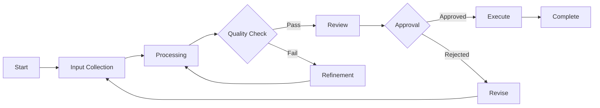
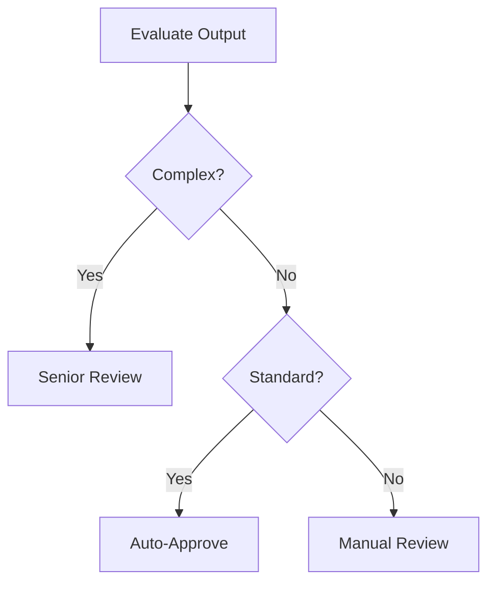

# [Workflow Name] Documentation

<!-- Replace [Workflow Name] with actual workflow name (e.g., "Construction Tender Creation Workflow") -->

## Executive Summary [REQUIRED]

### Workflow Purpose
<!-- What business process does this workflow automate/manage -->

### Key Stakeholders
- **Initiator**: [Who starts this workflow]
- **Participants**: [Who is involved]
- **Approvers**: [Who approves/reviews]
- **Beneficiaries**: [Who benefits from the output]

### Business Value
<!-- Time saved, accuracy improved, cost reduced, etc. -->
- **Before**: [Manual process taking X hours]
- **After**: [Automated process taking Y minutes]
- **Improvement**: [Z% efficiency gain]

---

## Workflow Overview [REQUIRED]

### High-Level Flow


### Process Stages
1. **Initiation**: [What triggers the workflow]
2. **Data Collection**: [What information is gathered]
3. **Processing**: [Main work performed]
4. **Validation**: [Quality checks applied]
5. **Review**: [Human or automated review]
6. **Execution**: [Final actions taken]
7. **Completion**: [Output delivered]

---

## Detailed Process Steps [REQUIRED]

### Step 1: [Initiation]
**Trigger**: [What starts this workflow]
**Actor**: [Human/System/Event]
**Inputs Required**:
- Input 1: [Description, format, source]
- Input 2: [Description, format, source]

**Validation**:
```javascript
function validateInitiation(inputs) {
    const errors = [];
    
    // Check required fields
    if (!inputs.projectId) {
        errors.push('Project ID is required');
    }
    
    // Validate formats
    if (!isValidFormat(inputs.data)) {
        errors.push('Invalid data format');
    }
    
    return {
        valid: errors.length === 0,
        errors
    };
}
```

**Output**: [What this step produces]

### Step 2: [Data Collection]
**Duration**: [Typical time]
**Systems Involved**: [List systems accessed]

**Data Sources**:
```javascript
const dataSources = {
    internal: {
        database: ['table1', 'table2'],
        apis: ['service1', 'service2'],
        files: ['templates', 'configs']
    },
    external: {
        apis: ['external-service'],
        databases: ['external-db']
    }
};
```

**Collection Logic**:
```javascript
async function collectData(context) {
    const data = {
        project: await getProjectData(context.projectId),
        historical: await getHistoricalData(context),
        regulations: await getRegulations(context.region),
        market: await getMarketData(context.type)
    };
    
    return enrichData(data);
}
```

### Step 3: [Processing]
**Agents Involved**:
- Agent 1: [Role and responsibility]
- Agent 2: [Role and responsibility]

**Processing Algorithm**:
```javascript
async function processWorkflow(data, agents) {
    // Stage 1: Analysis
    const analysis = await agents.analyst.analyze(data);
    
    // Stage 2: Optimization
    const optimized = await agents.optimizer.optimize(analysis);
    
    // Stage 3: Generation
    const output = await agents.generator.generate(optimized);
    
    return {
        analysis,
        optimized,
        output,
        confidence: calculateConfidence(output)
    };
}
```

### Step 4: [Quality Check]
**Automated Checks**:
```javascript
const qualityChecks = {
    completeness: (output) => {
        return output.requiredFields.every(field => output[field]);
    },
    
    accuracy: async (output) => {
        return await validateAgainstRules(output);
    },
    
    consistency: (output) => {
        return checkInternalConsistency(output);
    },
    
    compliance: async (output) => {
        return await checkCompliance(output, regulations);
    }
};
```

**Manual Review Points**:
- Review Point 1: [What is reviewed, by whom]
- Review Point 2: [What is reviewed, by whom]

### Step 5: [Approval]
**Approval Matrix**:
| Output Type | Value Range | Approver | SLA |
|-------------|------------|----------|-----|
| Type A | < $10k | Supervisor | 1 hour |
| Type A | $10k-$100k | Manager | 4 hours |
| Type A | > $100k | Director | 24 hours |

**Approval Logic**:
```javascript
async function routeForApproval(output) {
    const approver = determineApprover(output);
    
    const request = {
        id: generateId(),
        output,
        approver,
        deadline: calculateDeadline(approver.sla),
        escalation: defineEscalation(approver)
    };
    
    return await submitForApproval(request);
}
```

---

## Decision Points [REQUIRED]

### Decision 1: [Quality Gate]
```javascript
const qualityDecision = {
    criteria: {
        completeness: 0.95,  // 95% complete
        accuracy: 0.98,      // 98% accurate
        compliance: 1.0      // 100% compliant
    },
    
    evaluate: (metrics) => {
        for (const [criterion, threshold] of Object.entries(criteria)) {
            if (metrics[criterion] < threshold) {
                return {
                    pass: false,
                    reason: `Failed ${criterion}: ${metrics[criterion]} < ${threshold}`
                };
            }
        }
        return { pass: true };
    }
};
```

### Decision 2: [Routing Logic]


---

## Integration Points [REQUIRED]

### System Interactions
```javascript
const integrations = {
    inputSystems: [
        {
            name: 'Project Database',
            type: 'PostgreSQL',
            connection: 'primary-db',
            data: ['project_details', 'requirements']
        },
        {
            name: 'Document Store',
            type: 'S3',
            connection: 'doc-bucket',
            data: ['templates', 'attachments']
        }
    ],
    
    processingServices: [
        {
            name: 'ML Analysis Service',
            type: 'REST API',
            endpoint: '/api/analyze',
            timeout: 30000
        }
    ],
    
    outputSystems: [
        {
            name: 'Notification Service',
            type: 'Event Bus',
            topic: 'workflow-complete',
            format: 'JSON'
        }
    ]
};
```

### Data Transformations
```javascript
// Input transformation
function transformInput(rawData) {
    return {
        normalized: normalizeData(rawData),
        validated: validateData(rawData),
        enriched: enrichData(rawData)
    };
}

// Output transformation
function transformOutput(processedData) {
    return {
        formatted: formatForDisplay(processedData),
        summary: generateSummary(processedData),
        metadata: attachMetadata(processedData)
    };
}
```

---

## Error Handling [REQUIRED]

### Error Scenarios
| Error Type | Probability | Impact | Handling Strategy |
|------------|-------------|---------|-------------------|
| Input Validation | Medium | Low | Reject and request correction |
| System Timeout | Low | Medium | Retry with backoff |
| Processing Failure | Low | High | Fallback to manual |
| Approval Timeout | Medium | Medium | Escalate to next level |

### Recovery Procedures
```javascript
const errorHandlers = {
    validation: async (error, context) => {
        await notifyInitiator(error, context);
        return { action: 'retry', delay: 0 };
    },
    
    timeout: async (error, context) => {
        if (context.retries < 3) {
            return { action: 'retry', delay: exponentialBackoff(context.retries) };
        }
        return { action: 'manual_intervention' };
    },
    
    processing: async (error, context) => {
        await logError(error, context);
        await notifySupport(error, context);
        return { action: 'manual_fallback' };
    }
};
```

---

## Performance Metrics [REQUIRED]

### Key Metrics
| Metric | Target | Current | Measurement |
|--------|--------|----------|-------------|
| End-to-End Time | < 30 min | 25 min | Median |
| Success Rate | > 95% | 97% | Last 30 days |
| Manual Interventions | < 5% | 3% | Per 1000 runs |
| User Satisfaction | > 4.5/5 | 4.7/5 | Survey |

### Performance Optimization
```javascript
// Bottleneck analysis
const performanceProfile = {
    steps: {
        initiation: { avg: 30, max: 120 },      // seconds
        collection: { avg: 300, max: 600 },
        processing: { avg: 900, max: 1800 },
        approval: { avg: 600, max: 3600 }
    },
    
    optimizations: {
        parallelization: ['collection', 'processing'],
        caching: ['regulations', 'templates'],
        precomputation: ['market_data']
    }
};
```

---

## Human Interactions [REQUIRED]

### User Interfaces
1. **Initiation Form**
   - Fields: [List required fields]
   - Validation: [Client and server-side]
   - Help text: [Guidance provided]

2. **Review Dashboard**
   - Information displayed: [Key data points]
   - Actions available: [Approve/Reject/Request info]
   - Filters: [Status/Date/Type]

3. **Progress Tracker**
   - Current status indicator
   - Time elapsed/remaining
   - Next steps preview

### Notifications
```javascript
const notificationConfig = {
    channels: ['email', 'sms', 'in-app'],
    
    templates: {
        started: {
            subject: 'Workflow Started: {workflowId}',
            priority: 'normal'
        },
        
        approval_needed: {
            subject: 'Action Required: Approval for {workflowId}',
            priority: 'high'
        },
        
        completed: {
            subject: 'Workflow Completed: {workflowId}',
            priority: 'normal'
        }
    },
    
    routing: {
        initiator: ['started', 'completed', 'failed'],
        approver: ['approval_needed', 'escalated'],
        admin: ['failed', 'stuck']
    }
};
```

---

## Special Scenarios [OPTIONAL]

### Scenario 1: Rush Processing
**Trigger**: Priority flag set
**Changes**:
- Parallel processing enabled
- Higher resource allocation
- Expedited approval routing
- Real-time notifications

### Scenario 2: Bulk Processing
**Trigger**: Multiple items submitted
**Changes**:
- Batch optimization
- Grouped approvals
- Summary reporting
- Resource throttling

---

## Configuration [REQUIRED]

### Workflow Configuration
```javascript
const workflowConfig = {
    general: {
        timeout: 3600000,        // 1 hour total timeout
        retryAttempts: 3,
        parallelism: 5
    },
    
    steps: {
        collection: {
            timeout: 300000,     // 5 minutes
            retryable: true
        },
        processing: {
            timeout: 1800000,    // 30 minutes
            retryable: true
        },
        approval: {
            timeout: 86400000,   // 24 hours
            retryable: false
        }
    },
    
    quality: {
        thresholds: {
            completeness: 0.95,
            accuracy: 0.98
        }
    }
};
```

### Environment Variables
```bash
# Workflow configuration
WORKFLOW_TIMEOUT=3600000
WORKFLOW_PARALLELISM=5
WORKFLOW_RETRY_ATTEMPTS=3

# Integration endpoints
API_ENDPOINT=https://api.example.com
DB_CONNECTION=postgres://...

# Feature flags
ENABLE_PARALLEL_PROCESSING=true
ENABLE_AUTO_APPROVAL=true
```

---

## Monitoring & Alerting [REQUIRED]

### Health Indicators
```javascript
const healthChecks = {
    queueDepth: {
        healthy: (depth) => depth < 100,
        warning: (depth) => depth < 500,
        critical: (depth) => depth >= 500
    },
    
    processingTime: {
        healthy: (time) => time < 1800,    // 30 min
        warning: (time) => time < 3600,    // 1 hour
        critical: (time) => time >= 3600
    },
    
    errorRate: {
        healthy: (rate) => rate < 0.01,    // 1%
        warning: (rate) => rate < 0.05,    // 5%
        critical: (rate) => rate >= 0.05
    }
};
```

### Alert Configuration
| Alert | Condition | Recipients | Action |
|-------|-----------|-----------|---------|
| Workflow Stuck | No progress > 1hr | Ops Team | Investigate |
| High Error Rate | Errors > 5% | Dev Team | Debug |
| SLA Breach | Completion > target | Management | Report |
| System Down | Health check fail | On-call | Restart |

---

## Testing [REQUIRED]

### Test Scenarios
```javascript
describe('Workflow Tests', () => {
    test('Happy path - standard workflow', async () => {
        const input = createStandardInput();
        const result = await runWorkflow(input);
        
        expect(result.status).toBe('completed');
        expect(result.duration).toBeLessThan(1800000);
    });
    
    test('Error handling - invalid input', async () => {
        const input = createInvalidInput();
        const result = await runWorkflow(input);
        
        expect(result.status).toBe('failed');
        expect(result.error).toContain('validation');
    });
    
    test('Performance - bulk processing', async () => {
        const inputs = createBulkInputs(100);
        const startTime = Date.now();
        
        const results = await Promise.all(
            inputs.map(input => runWorkflow(input))
        );
        
        const duration = Date.now() - startTime;
        expect(duration).toBeLessThan(3600000); // 1 hour for 100
    });
});
```

---

## Version History

| Version | Date | Changes | Author |
|---------|------|---------|--------|
| 1.0 | YYYY-MM-DD | Initial workflow design | [Name] |

---

## Appendix [OPTIONAL]

### Glossary
| Term | Definition |
|------|------------|
| [Term] | [Definition] |

### Sample Data
```json
{
    "sampleInput": {
        "projectId": "uuid",
        "type": "construction",
        "data": {}
    },
    
    "sampleOutput": {
        "result": {},
        "metadata": {}
    }
}
```

<!-- Tips:
1. Use real examples and data
2. Include actual timings and metrics
3. Document all decision logic clearly
4. Keep diagrams simple and readable
5. Update when workflow changes
-->
